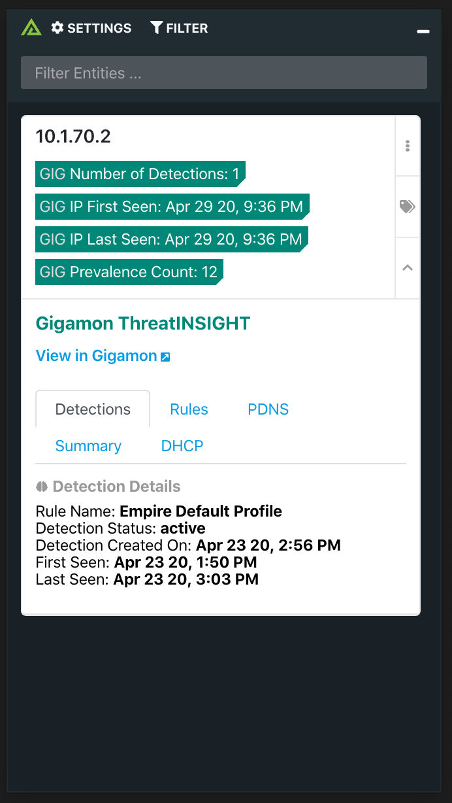
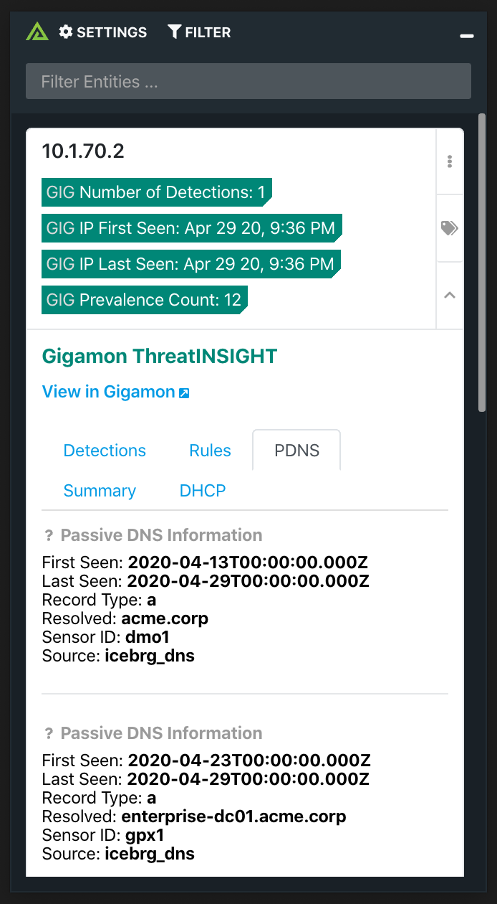
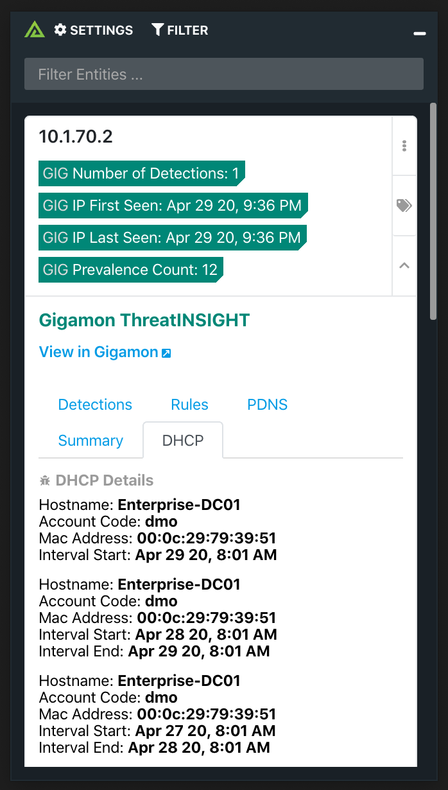

# Polarity Gigamon ThreatINSIGHT Integration

The Polarity - Gigamon integration searches Gigamon for detection information as well as any associated DHCP, PDNS or Summary information.

  
  

  

To learn more about Gigamon, please visit the [official website](https://www.gigamon.com/).

## Gigamon Integration Options

### Gigamon ApiKey
Gigamon API token. You can find your api token by navigating to your account. 

### Gigamon Account UUID
Account UUID. Your Account UUID found in your profile on the Dashboard. Used to filter down detection results.

### Ignore List
List of domains that you never want to send to Gigamon ThreatINSIGHT.

### Ignore Domain Regex
Domains that match the given regex will not be looked up.

### Ignore IP Regex
IPs that match the given regex will not be looked up.

## Installation Instructions

Installation instructions for integrations are provided on the [PolarityIO GitHub Page](https://polarityio.github.io/).

## Polarity

Polarity is a memory-augmentation platform that improves and accelerates analyst decision making.  For more information about the Polarity platform please see:

https://polarity.io/